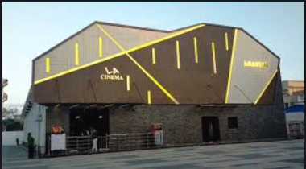
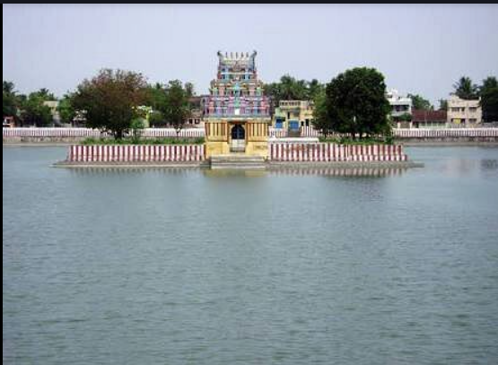

# Ex04 Places Around Me
## Date: 30/04/2025

## AIM
To develop a website to display details about the places around my house.

## DESIGN STEPS

### STEP 1
Create a Django admin interface.

### STEP 2
Download your city map from Google.

### STEP 3
Using ```<map>``` tag name the map.

### STEP 4
Create clickable regions in the image using ```<area>``` tag.

### STEP 5
Write HTML programs for all the regions identified.

### STEP 6
Execute the programs and publish them.

## CODE
```
home.html

<!-- Image Map Generated by http://www.image-map.net/ -->


<map name="image-map">
    <area target="" alt="haridra nadhi" title="haridra nadhi" href="lake.html" coords="461,154,407,119" shape="rect">
    <area target="" alt="sri rajagopalaswamy temple" title="sri rajagopalaswamy temple" href="temple.html" coords="465,331,35" shape="circle">
    <area target="" alt="LA cinema shanthi" title="LA cinema shanthi" href="cinema.html" coords="509,418,515,398,500,384,485,389,484,413" shape="poly">
</map>
```
```
temple.html

<html>
    <head><h1>temple</h1></head> 
    <title>nearme</title>
    <body text="blue" bgcolor="white">
        <i>God</1>
         
    </body> 
</html>
```
```
cinema.html

<html>
    <head><h1>cinema</h1></head> 
    <title>nearme</title>
    <body text="black" bgcolor="green">
        <i>Movie Time</1>
         
    </body> 
</html>
```
```
lake.html

<html>
    <head><h1>Lake</h1></head> 
    <title>nearme</title>
    <body text="red" bgcolor="blue">
        <i>Nature</1>
         
    </body> 
</html>
```

## OUTPUT


## RESULT
The program for implementing image maps using HTML is executed successfully.
